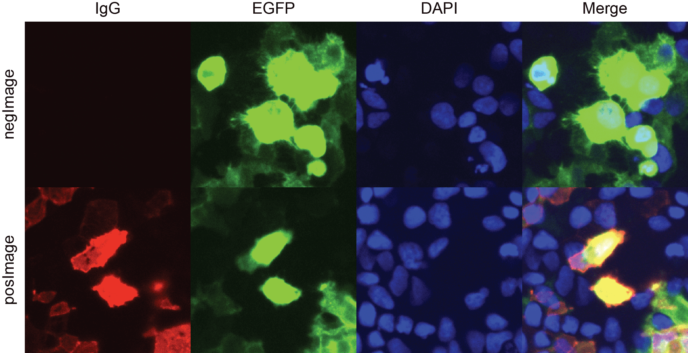
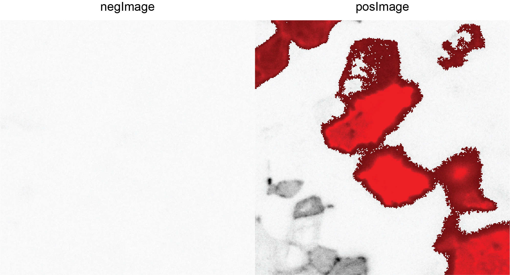
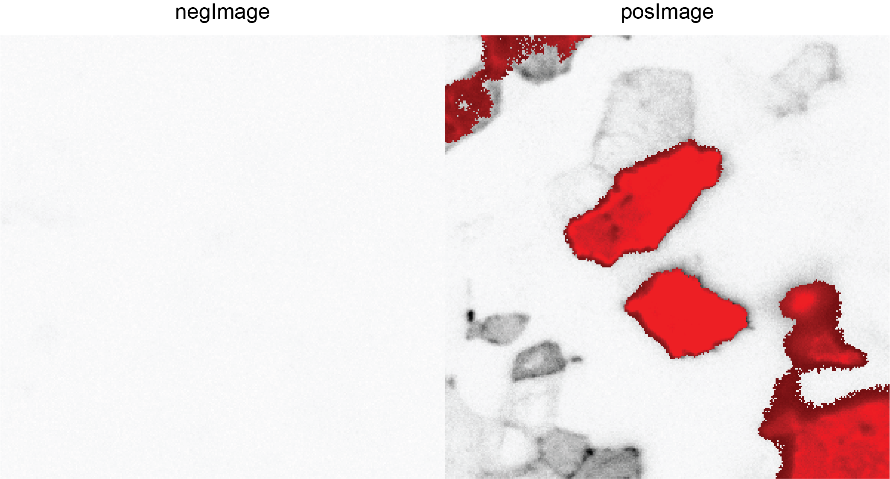

```{r style, echo=FALSE, results='hide', message=FALSE}
library(BiocStyle)
library(knitr)
opts_chunk$set(error = FALSE, message = FALSE, warning = FALSE, echo = TRUE)
```

# Introduction

This software is primarily meant to be used for classification of images of
cell-based assays for neuronal surface autoantibody detection or similar
techniques, which is the standard diagnostic and research method of use
in the field of autoantibody-driven autoimmune encephalitis, see e.g. 
"Detection Methods for Autoantibodies in Suspected Autoimmune Encephalitis", 
by Ricken et al, Frontiers in Neurology, 2018. Even as images of cell-based 
assays for a long time have been commonplace in the diagnostic procedure, the 
most wide-spread way of grading these is still by expert inspection and opinion.
This is in my opinion problematic both as it hinders the dissemiation of
research to environments that lack the sample volumes that can enable the 
training of specialists in the area, and furthermore it might increase the 
inter-rater variance. Thirdly, to be able to screen through thousands of
samples, which is necessary to reach more epidemiological conclusions in this
field, an automated screening methodology is warranted. This package has been 
created to address these needs. 
It takes images of cell-based assays as input and creates a composite score
from these, that then can be used to classify samples as negative or
positive for a certain antibody-specificity. The reason for the name "islify"
is that I during its creation have thought about the individual picture as an
archielago where we with different filters control the water level as well
as ground characteristica, thereby creating and describing islands of interest. 

Below, the standard workflow of islify is presented, with two different user
cases; situations with and without a reference color. A reference color in this
context refers to a color that is co-localized with the color of interest (here
called "focus"). The most common example in antibody-screening situations would
be that the focus protein is fused to EGFP. In such cases, it is only in areas 
where EGFP is expressed that any specific antibody-binding to the focus protein
is expected. In both cases, a nuclear staining is suggested, even if not
mandatory, to simplify the definition of the nuclear diameter - an important
compontent to the filters of the islify function. The islify function is the
central component this software. It generates a score per image that 
corresponds to the fraction of the total number of pixels that are taken up by
"islands", i.e. confluences of high-intensity signal in the focus channel. 

# Preparatory parts of workflow

## Installation
This is how to install the package, if that has not already been done: 
```{r, eval = FALSE}
if (!requireNamespace("BiocManager", quietly = TRUE)) {
    install.packages("BiocManager")
}
BiocManager::install("islify")
```

## Example data description

The example data provided consists of small areas of two images, one with 
positive antibody staining and one lacking such signal. The focus protein 
in question is fused to EGFP. Furthermore, their nuclei are stained with DAPI.

```{r}
library(islify)
data(posImage)
data(negImage)
```

## getQuantileIntensities usage

This function provides an excellent first step to get an overview of the
internals of the image files. 

```{r}
quantIntensities <- getQuantileIntensities(list(posImage),
    quantiles = c(0.9, 0.95, 0.99)
)
quantIntensities
```

This output tells us a number of things:

1. these files are seemingly normalised to the 0-1 range. 
    + Often, this is done in an RGB-compliant manner, so that each files lowest
    and highest values are set to 0 and 1, but it is much preferred if files
    with the original intensities are saved, as this will allow us to make more
    accurate between-image comparisons, which is of course the core point of
    this package. 
    + In this specific case, the files have been normalised together, and
    therefore they can still be compared with the same intensity thresholds,
    etc. 
2. We can furthermore learn that the file contains three colors and
we can also see that this file seems to have reasonably balanced intensities in
the three different colors, which all show very skewed distributions. 
    + A point worth making here and repeatedly is that the colors can have
    any order within the data. As multiple file formats are accepted, and as
    the metadata containing the information about said order differs
    substantially between the formats, it is up to the user to provide the
    information about which frame in the files that contain which color.
    Currently, only three colors are accepted, and as the visual output are
    RGB-based png files, red, green and blue are the only supported colors. If
    this restricts you, then please reach out and we can discuss workarounds
    and updates to the package. 
    + Therefore, NB: If the order of the colors in the file in fact is DAPI
    for nuclear staining (blue), then phycoerythrin for IgG
    staining (red) and finally fusion-protein EGFP (green), and the user
    provides the color order Red-Green-Blue, then the nuclei will look red,
    the IgG green and the EGFP blue in the output, so this can lead to severe
    misinterpretation. So make sure to check this order before, e.g. by
    investigating one or a few files briefly with ImageJ or simply by comparing
    positive and negative controls with the getQuantileIntensities function.

## Use saveImage for quality control and sanity checks
With saveImage, you can save any one of the colors in the data, as well as 
a merge of all colors. The standard user case is including all individual 
colors as well as the merge:

```{r eval=FALSE}
saveImage(list(posImage, negImage), c("pos", "neg"),
    frameNums = "All",
    frameCols = c("R", "G", "B"), truncTo =
        quantIntensities[[1]][, "Percent_95"],
    outDir = "."
)
```
This generates eight png files in the outDir directory, divided in 
per color sub-directories. These eight images are summarised here: 

These images shows us a number of things, including that with this specific 
HEK-derived cell-line, the nuclei are considerably smaller than the cells in
many instances, and further that areas with very high EGFP expression does not
always correlate strongly to high IgG binding. These plots also tell us that
it seems like we got hte colors right: the blue color does look like the 
expected nuclear staining, and the green is as prevalent in the negImage as
the posImage, whereas the red image is negative for the negImage, which makes
sense, given that both were transfected, but the negImage was stained with
negative control serum. 

# islify support functions
Now, we go into the pre-islify phase, where the nuclear size threshold as well 
as the intensity threshold(s) are defined. 

## getSizeCutoff
Here, the nuclear size is defined. In the algorithm, the nuclear size is used
to define the narrowest allowed part of an island. As we are using the nuclear
staining, and we know that the blue DAPI staining is in the third frame of the
image objects in this case, we set frameNum to 3. 

```{r}
sizeCutoff <- getSizeCutoff(imgDirs = list(negImage, posImage), frameNum = 3)
sizeCutoff
```

## getIntensityCutoff for the antibody (and EGFP) staining(s)
Now, we are going to define the background noise level for the focus channel,
(here the red IgG) and in applicable cases, such as with the example data,
repeat the procedure for the reference chanel, in this case the EGFP. 
We start with the IgG/focus channel: 
```{r}
intensityCutoffRed <- getIntensityCutoff(
    imgDirs = list(negImage, posImage),
    frameNum = 1,
    ignore_white =
        quantIntensities[[1]][, "Percent_90"][1]
)
intensityCutoffRed
```
There is no perfect way of doing this: with the selected standard method, 
Triangle, we seem to get meaningful results, but we both struggle with some 
filters being set too high, and a considerable sensitivity to the top fraction
of positive values; for IgG the filter threshold becomes much higher if a 
positive control is used instead of a negative one. The way to at least partly 
remedy this is by including the "ignore_white" parameter. What this does is to
discard any value above this "white" in the calculations of the background. In 
this case, as we have already calculated the quantile intensities for the 
positive image, we can use these to improve the calculation of this threshold. 

Here we run the optional EGFP channel intensityCutoff identification: 
```{r}
intensityCutoffGreen <- getIntensityCutoff(
    imgDirs = list(posImage),
    frameNum = 2,
    ignore_white =
        quantIntensities[[1]][, "Percent_90"][2]
)
intensityCutoffGreen
```

# Islify function in its two shapes
Now, all the components are in place for the islify function to be run. 

## Running islify for samples lacking co-expression markers
This is the most generalisable case of the function, that works well in 
instances with a high signal-to-noise ratio for the antibody marker. Examples 
where this works well are for GABAB and CASPR2 antibody detection. 

```{r eval=FALSE}
result <- islify(
    imgDirs = list(negImage, posImage),
    imgNames = c("Neg", "Pos"),
    frameNumFocus = 1,
    sizeCutoff = sizeCutoff,
    intensityCutoffFocus =
        intensityCutoffRed,
    truncLim =
        quantIntensities[[1]][, "Percent_95"][1]
)
```

```{r echo=FALSE}
result <- islify(
    imgDirs = list(negImage, posImage),
    imgNames = c("Neg", "Pos"),
    frameNumFocus = 1,
    sizeCutoff = sizeCutoff,
    intensityCutoffFocus =
        intensityCutoffRed,
    diagnoImgs = FALSE
)
```
```{r}
result
```
Here, we get two results: first the intensityCutoff is reported back. In this
case, it is not very useful, as we provided it before, but as one can have
individualised thresholds for each file, it is important to get it. In cases
with extremely high background, such as with fixed cell-based assays, there is
a high noise flag that can turn an extra filtering step on. In this case, this
second filter will also be reported back in the results. Finally, the central
result is presented as the fraction of the total number of pixels that are 
IgG positive. 

This function can in addition to these results also generate a diagnostic
image for each analysed image. These images look like this, with the red colors
indicating the selected islands: 


## Running islify including a reference color
Here, we add the information gathered about the EGFP as well, to further
select the areas of analysis. This might not make very much sense in this
very clean example, but in more noisy, normal-world data, it is often this
cleanup step that makes this method advantageous compared to direct visual
analysis. 

```{r eval=FALSE}
result <- islify(
    imgDirs = list(negImage, posImage),
    imgNames = c("Neg", "Pos"),
    frameNumFocus = 1,
    frameNumReference = 2,
    sizeCutoff = sizeCutoff,
    intensityCutoffFocus =
        intensityCutoffRed,
    intensityCutoffReference =
        intensityCutoffGreen,
    truncLim =
        quantIntensities[[1]][, "Percent_95"][1]
)
```

```{r echo=FALSE}
result <- islify(
    imgDirs = list(negImage, posImage),
    imgNames = c("Neg", "Pos"),
    frameNumFocus = 1,
    frameNumReference = 2,
    sizeCutoff = sizeCutoff,
    intensityCutoffFocus =
        intensityCutoffRed,
    intensityCutoffReference =
        intensityCutoffGreen,
    truncLim =
        quantIntensities[[1]][, "Percent_95"][1],
    diagnoImgs = FALSE
)
```
```{r}
result
```
Here, the output contains information both about the reference and the focus; 
the intensity thresholds are included for both, as well as the fraction of 
the total pixels that are reference-coloured or focus-coloured. A combination
of the two, namely the fraction of reference that are also focus-coloured is
the crown of the whole thing. 

And the positive image is in this case somewhat cleaner: 


# Conclusion
In this document, a typical analysis of cell-based assays for autoantibody
screening is described. Other applications in similar fields, such as binding 
patterns to neurons are also possible to conceive and more intelligent filters
or masks can certainly also be found. This attempt however seems to work for
a number of tests in the field of autoimmune neurology autoantibody screening.
If you have ideas for similar applications, or cannot find your file format, 
please reach out. 

# Session information
```{r}
sessionInfo()
```
